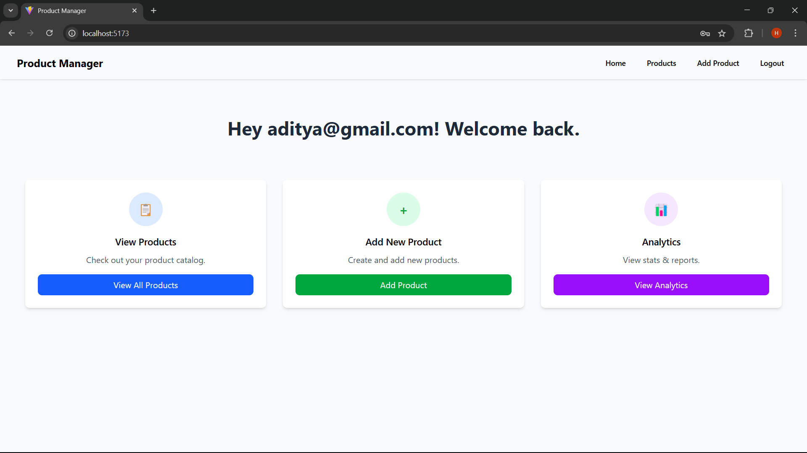
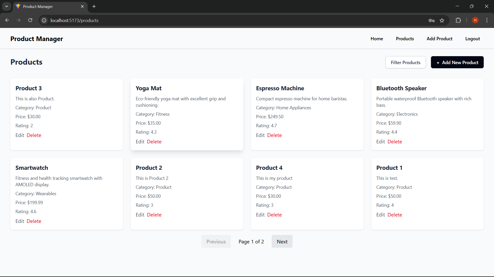
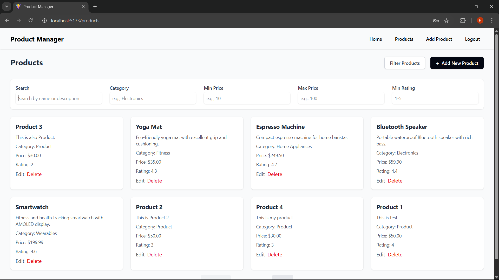
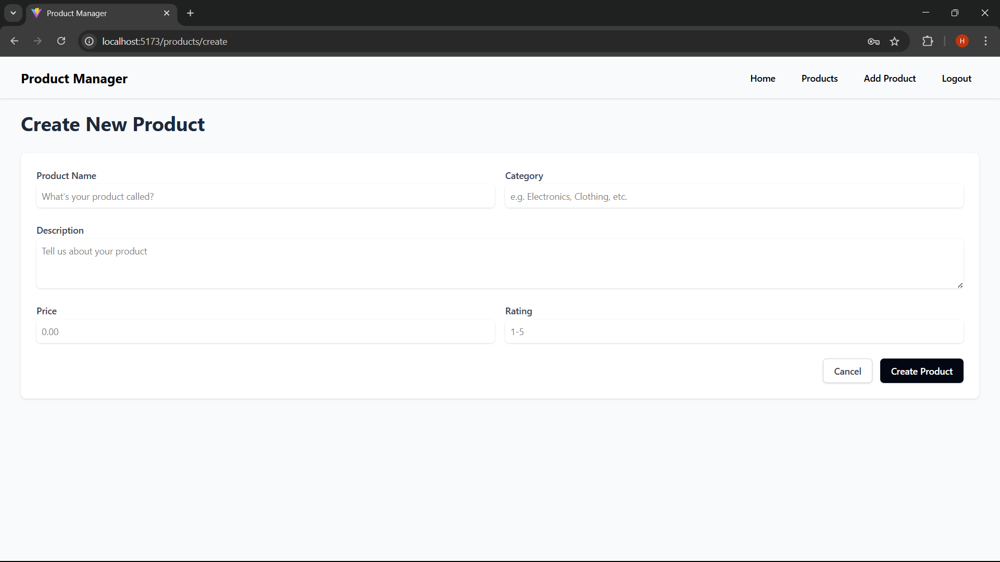
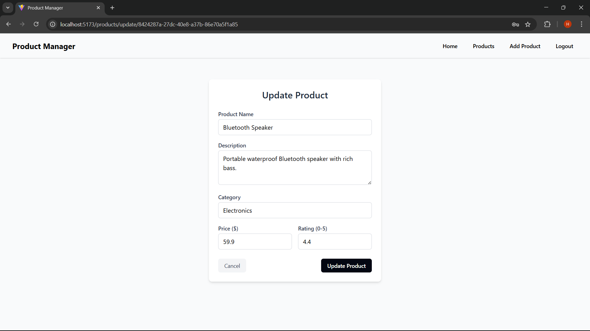
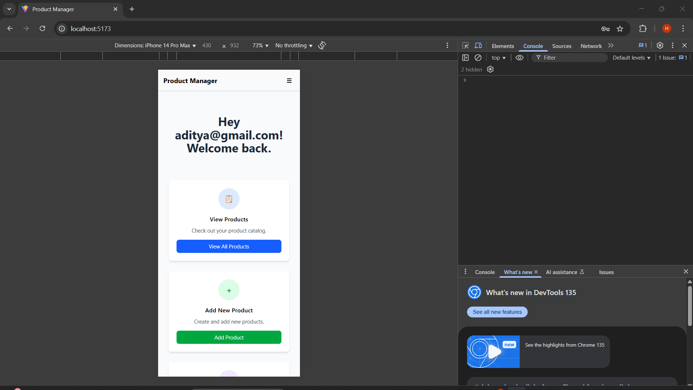
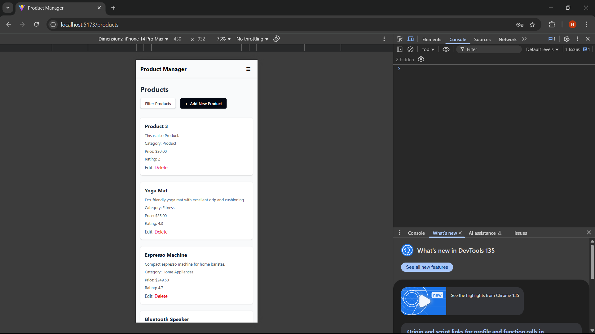

# Product Management System

A full-stack web application for product management with authentication, filtering, and CRUD operations.

## Features

- **User Authentication**: Secure signup and login functionality
- **Product Management**: Create, read, update, and delete products
- **Advanced Filtering**: Search and filter products by multiple criteria
- **Responsive Design**: Mobile-friendly interface

## Tech Stack

### Frontend

- React
- TypeScript
- Tailwind CSS
- Vite
- React Router DOM
- Axios

### Backend

- NestJS
- TypeScript
- JWT Authentication
- Class Validator
- Supabase (Database)

## Screenshots

### Home Page



### Products List



### Products with Filtering



### Add Product



### Update Product



### Responsive Design

<div style="display: flex; gap: 10px;">
  
  
  
</div>

## Getting Started

### Prerequisites

- Node.js (v16 or higher)
- npm or yarn

### Installation

1. Clone the repository:

```bash
git clone https://github.com/yourusername/product-management-system.git
```

2. Install dependencies:

```bash
# Install root dependencies
npm install

# Or install client and server separately
npm run install:client
npm run install:server
```

3. Set up environment variables:

   - Create a `.env` file in the server directory based on the `.env.example`

4. Start the development server:

```bash
# Start both client and server
npm start

# Start client only
npm run start:client

# Start server only
npm run start:server
```

## API Endpoints

### Authentication

- `POST /api/auth/signup`: Register a new user
- `POST /api/auth/login`: Login and get JWT token

### Products

- `GET /api/products`: Get all products with optional filtering
- `GET /api/products/:id`: Get a single product
- `POST /api/products`: Create a new product
- `PATCH /api/products/:id`: Update a product
- `DELETE /api/products/:id`: Delete a product

## Deployment

This application is configured for deployment on Vercel:

1. Push your code to GitHub
2. Connect your repository to Vercel
3. Configure environment variables in Vercel dashboard
4. Deploy

## Project Structure

```
├── client/                # React frontend
│   ├── public/            # Static files
│   └── src/               # Source files
│       ├── api/           # API client configuration
│       ├── components/    # React components
│       └── assets/        # Images and other assets
│
└── server/                # NestJS backend
    └── src/               # Source files
        ├── auth/          # Authentication module
        ├── product/       # Product module
        └── user/          # User module
```

## License

This project is licensed under the MIT License - see the LICENSE file for details.

## Acknowledgments

- NestJS documentation
- React documentation
- Tailwind CSS
- Supabase
